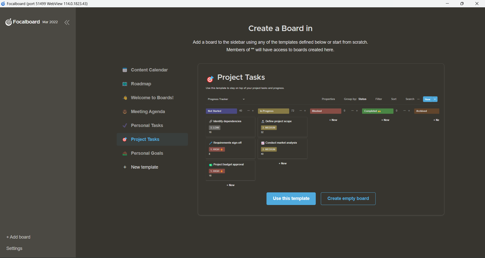

# Tugas Manajemen Proyek Focalboard

Tugas Manajamen Proyek UPN "Veteran" Jawa Timur

Muhammad Dhiya'ulhaq Rizqulloh Zain \[19081010169\]

## Focalboard
### A. Pengertian Focalboard

    
  Focalboard

Focalboard adalah alternatif open source untuk alat seperti Asana, Trello, dan Notion. Tersedia sebagai aplikasi yang berdiri sendiri atau terintegrasi ke dalam platform Mattermost, Focalboard membantu pengembang tetap selaras untuk menyelesaikan tugas, mencapai pencapaian, dan mencapai tujuan mereka.

Konsep dasar di balik Focalboard adalah papan (board) fokus yang berisi daftar tugas atau item yang perlu diselesaikan. Papan ini biasanya terdiri dari beberapa kolom atau daftar, yang mewakili berbagai tahapan atau kategori dalam proses kerja. Misalnya, kolom dapat disusun dalam urutan seperti "Tugas Baru", "Dalam Pengerjaan", "Dalam Ulasan", dan "Selesai".

Focalboard memungkinkan pengguna untuk membuat kartu (card) tugas individual pada setiap kolom atau daftar. Kartu-kartu ini dapat berisi judul tugas, deskripsi, tanggal tenggat waktu, label, atau atribut lainnya yang relevan. Pengguna dapat menyeret dan menjatuhkan kartu dari satu kolom ke kolom lainnya untuk menunjukkan perpindahan status tugas.

Salah satu fitur kunci Focalboard adalah kemampuannya untuk berkolaborasi. Pengguna dapat mengundang anggota tim lainnya untuk bergabung dalam papan fokus yang sama, sehingga mereka dapat berbagi, mengedit, dan berkomentar pada kartu-kartu tugas. Ini memungkinkan tim untuk bekerja bersama, melacak kemajuan, memberikan umpan balik, dan mengkoordinasikan upaya mereka.

Jika ingin mendownload Focalboard untuk platform Windows klik [link berikut ini](https://www.focalboard.com/download/personal-edition/desktop/)!

## Cara Penggunaan tool Focalboard
### 1.	Instalasi Focalboard di Windows

Kita dapat mendownload *tool* Focalboard dengan Microsoft Store melalui [link](https://www.focalboard.com/download/personal-edition/desktop/) yang disematkan sebelumnya. Selanjutnya, kita pilih download untuk windows. Dan selanjutnya kita dapat memilih download menggunakan microsoft store atau melalui Github. Disini saya mendownload Focalboard melalui Microsoft Store.

    
  Download Focalboard

### 2. Membuat Project Baru

Setelah melakukan proses instalasi dan mengakses Focalboard, berikut adalah tampilan awal tool Focalboard:

Header: Pada bagian atas halaman, Anda akan melihat header Focalboard. Di sini, Anda akan menemukan nama aplikasi dan mungkin beberapa menu dan opsi lainnya tergantung pada konfigurasi khusus.

Menu Samping: Di sebelah kiri halaman, ada menu samping yang berisi berbagai opsi dan navigasi. Menu ini biasanya berisi daftar proyek atau papan yang telah Anda buat, serta opsi untuk membuat proyek baru, mengundang anggota tim, dan mengelola pengaturan.

Daftar Proyek atau Papan: Setelah membuat proyek atau papan, Anda akan melihat daftar proyek atau papan yang ada. Biasanya, daftar ini akan menampilkan ikon atau judul proyek dan mungkin juga beberapa informasi tambahan seperti anggota tim atau status.

Pembuatan Proyek Pertama: Untuk membuat proyek pertama Anda, Anda dapat memilih opsi "Project Task" di bawah header "Create a Board in". Biasanya, ini adalah pilihan standar yang tersedia pada Focalboard.

Opsi Pembuatan Proyek: Setelah memilih "Project Task", Anda akan diberikan opsi untuk membuat proyek dengan memilih "Use this template" atau "Create empty board".

"Use this template": Jika Anda memilih opsi ini, Anda akan diberikan beberapa template proyek yang telah dipersiapkan sebelumnya. Template ini bisa berupa tata letak dan struktur tugas yang telah ditentukan sebelumnya untuk jenis proyek tertentu, seperti manajemen proyek, manajemen produk, pemasaran, dan lain sebagainya. Anda dapat memilih template yang sesuai dengan kebutuhan Anda dan melanjutkan dengan menggunakan tata letak tersebut.

"Create empty board": Jika Anda memilih opsi ini, Anda akan membuat papan kosong tanpa template yang telah ditentukan sebelumnya. Dengan pilihan ini, Anda akan mulai dari awal dan dapat membuat struktur dan tata letak tugas sesuai kebutuhan Anda sendiri.

Setelah memilih opsi yang diinginkan, Anda akan diarahkan ke proyek baru Anda dengan papan yang sesuai. Anda dapat mulai menambahkan kartu tugas, mengatur kolom, mengundang anggota tim, dan melakukan pengaturan lainnya sesuai dengan proyek Anda.

    

